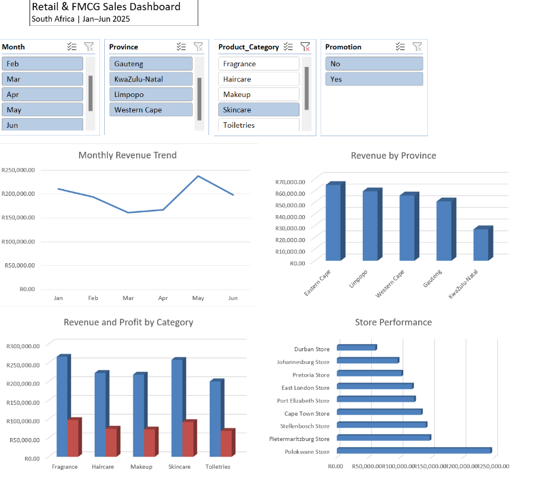

# Retail & FMCG Sales Dashboard (South Africa)

## Overview
This project analyzes retail and FMCG sales performance across multiple stores in South Africa. The dashboard provides insights into revenue trends, regional performance, product category contribution, and store-level performance.

---

## Tools Used
- Microsoft Excel (Pivot Tables, Charts, Dashboard Design)

---

## Key Insights
- Revenue trends show fluctuations across months, with peak performance observed mid-period.
- Certain provinces outperform others in total revenue contribution.
- Product categories contribute differently to revenue and profit.
- Store performance varies significantly across locations.

---

## Recommendations
- Focus on high-performing regions to maximize revenue growth.
- Improve performance in lower-performing stores.
- Optimize product mix based on category performance.
- Monitor monthly trends to improve planning and forecasting.

---

## Dashboard Preview

